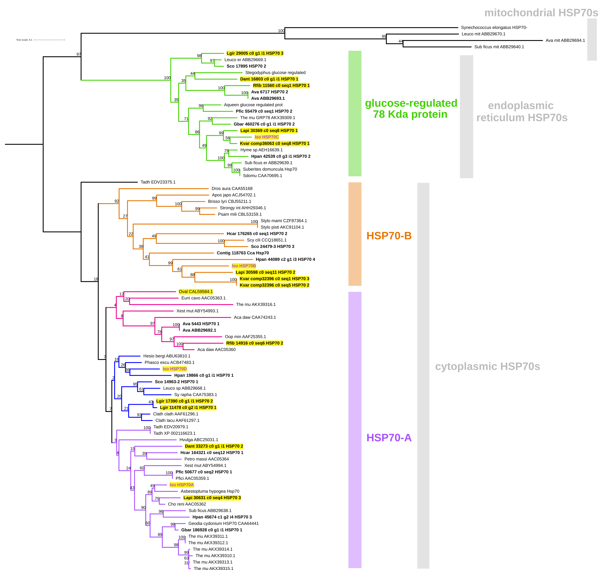

```{r setup, include=FALSE}
knitr::opts_chunk$set(echo = TRUE)
```

## Warm temperatures, cool sponges: the effect of increased temperatures on the Antarctic sponge Isodictya sp.

### González-Aravena et al., 2019

Checking whether the packages are required/already installed or not. If they are not installed following code installs the packages and then load the packages.
```{r warning=FALSE, message=FALSE}
if (!require("Hmisc")) install.packages("Hmisc")
library("Hmisc")
if (!require("corrplot")) install.packages("corrplot")
library(corrplot)
if (!require("tidyverse")) install.packages("tidyverse")
library(tidyverse)
if (!require("gplots")) install.packages("gplots")
library(gplots)
if (!require("seqinr")) install.packages("seqinr")
library(seqinr)

# packages for phylogenetic analysis
if (!require("ape")) install.packages("ape")
library(ape)
if (!require("phangorn")) install.packages("phangorn")
library(phangorn)
if (!require("phytools")) install.packages("phytools")
library(phytools)
if (!require("geiger")) install.packages("geiger")
library(geiger)
```

Isodictya differential expression data are read from the data file to a dataframe.
```{r}
diffExpr_data = read.table("../data/Isodictya_diffExpr.data", header=T, com='', sep="\t", row.names=1, check.names=F)
```

Dataframe is converted as a matrix using as.matrix() function.
```{r}
diffExpr_data = as.matrix(diffExpr_data)
```

## Reproducing the figure 2A: Sample correlation matrix for the five samples used in the final cross-comparison.

Correlation of data is calculated by Spearman's rank correlation coefficient method usiing cor() function.
```{r}
diffExpr.cor = cor(diffExpr_data, method = c("spearman"))
```

Color palette for correlation heatmap is generated using colorRampPalette() function. This function extends a color palette to a color ramp.
```{r}
palette.cor = colorRampPalette(c("green", "black", "red")) (20)
```

Heatmap of sample correlation matrix for the five samples is generated using heatmap.2().heatmap.2() is an enhanced Heat Map which provides a number of extensions to the standard R heatmap function.
```{r}
heatmap.2(diffExpr.cor, scale = "none", col = palette.cor, symm = TRUE, trace = "none", density.info = "none", RowSideColors = c(rep("green", 2), rep("blue", 2), rep("red", 1)), ColSideColors = c(rep("green", 2), rep("blue", 2), rep("red", 1)))
```

## Reproducing the figure 2B: Relative expression of each differentially expressed contig across all the samples.

Sample data information is read from the samples files which includes details about the samples used in the experiment.
```{r}
samples = read.table("../data/samples.txt", header=F, check.names=F, fill=T)
```

Sample types are extracted from the sample dataframe.
```{r}
sample_types = as.character(unique((samples[samples[,2] != '',])[,1]))
```

Data transformations are done in order to prepare data for producing the hetamap in figure 2B.
```{r}
diffExpr_data = diffExpr_data[, colnames(diffExpr_data) %in% samples[,2], drop=F ]
diffExpr_data = log2(diffExpr_data+1)
diffExpr_data = as.matrix(diffExpr_data)
diffExpr_data = t(scale(t(diffExpr_data), scale=F))
```

Color palette for differential expression heatmap is generated using colorRampPalette() function.
```{r}
palette.diffexpr <- colorRampPalette(c("purple", "black", "yellow"))(256)
```

Figure 2B differential expression heatmap is generated using heatmap.2() function.
```{r}
heatmap.2(diffExpr_data, dendrogram='both', scale="none", density.info="none", trace="none", key=TRUE, keysize=1.2, cexCol=1, margins=c(10,10), cex.main=0.75, col = palette.diffexpr, ColSideColors = c(rep("green", 2), rep("blue", 2), rep("red", 1)))
```

## Attempting to reproduce figure 4A phylogenetic tree using R.

Reading the multiple sequence alignment from the alignment file. Multiple sequence alignment was done using MAFFT sequence alignment tool prior to tree construction in R.
```{r eval=FALSE}
multi_seq_align  <- read.alignment(file = "../data/isodictya_msa.phy", format = "phylip")
```

Convert the alignment to "DNAbin" format.
```{r eval=FALSE}
multi_seq_align.bin <- as.DNAbin(multi_seq_align)
```

Calculate the genetic distance matrix.
```{r eval=FALSE}
multi_seq_align.dist <- dist.dna(multi_seq_align.bin)
```

We tried to generate the NJ tree instead of maximum likelihood tree using the following function and the multiple sequence alignment.
```{r eval=FALSE}
isodictyatree <- function(alignment,type)
  {
     # define a function for making a tree:
     maketree <- function(alignmentmat)
     {
        alignment <- ape::as.alignment(alignmentmat)
        if      (type == "protein")
        {
           mydist <- dist.alignment(alignment)
        }
        else if (type == "DNA")
        {
           alignmentbin <- as.DNAbin(alignment)
           mydist <- dist.dna(alignmentbin)
        }
        mytree <- nj(mydist)
        mytree <- makeLabel(mytree, space="") # get rid of spaces in tip names.
        return(mytree)
     }
     # infer a tree
     mymat  <- as.matrix.alignment(alignment)
     mytree <- maketree(mymat)
     # bootstrap the tree
     myboot <- boot.phylo(mytree, mymat, maketree)
     # plot the tree:
     plot.phylo(mytree,type="u")   # plot the unrooted phylogenetic tree
     nodelabels(myboot,cex=0.7)    # plot the bootstrap values
     mytree$node.label <- myboot   # make the bootstrap values be the node labels
     return(mytree)
}
```

Constructing the phylogenetic tree based on the alignment.
```{r eval=FALSE}
phylotree <- isodictyatree(multi_seq_align, type="DNA")
```

Saving the phylogenetic tree as a Newick-format tree file.
```{r eval=FALSE}
write.tree(phylotree, "../trees/isodictya.tre")
```

**We were trying to use R to construct the phylogeny since R was the one we learned in the class. But unfortunately we couldn't make it work. We tried several ways referring many tutorial and using many packages, but we were unable to get the exact output we wanted. Because of that we used RAxML phylogeny construction tool as mentioned in the paper.

## Reproduced Figure 4A: Maximum likelihood-derived phylogeny

itol tool was used to add annotations and to visualize the tree.



## Phylogenetic tree visualization and rooting in R

In here we used R packages to visualize and root the tree produced in RAxML-NG.

Reading the phylogenetic tree.
```{r}
iso.tree <- read.tree(file = "../trees/iso.tre")
```

Visualize the tree in rectangular layout.
```{r}
plotTree(iso.tree, ftype = "i", fsize = 0.6, lwd = 1)
```

Write the tree into a file.
```{r eval=FALSE}
write.tree(tree,file="../trees/Isodictya.tre")
```

Visualize the tree as unrooted in radial layout.
```{r}
plot(unroot(iso.tree), type = "unrooted", cex = 0.6, use.edge.length = FALSE, lab4ut = "axial", no.margin = TRUE)
```

Visualize the tree in polar layout.
```{r}
plotTree(iso.tree, type = "fan", fsize = 0.7, lwd = 1, ftype = "i")
```

Visualize the tree with node number for rooting.
```{r}
plotTree(iso.tree, ftype = "i", node.numbers=T, fsize = 0.6, lwd = 1)
```

Rooting the tree at node 110 and visualize it.
```{r}
rr.110 <- root(iso.tree, node=110)
plotTree(rr.110)
```

## Few important codes used in external programs

### Running command line blast.

Making a dna blast database of the genomes.
```{r eval=FALSE}
makeblastdb -in Isodictya_without_103_clean.fa -dbtype nucl -input_type fasta -out Isodictyadb
```

Running nucleotide blast in the command line.
```{r eval=FALSE}
blastn -db Isodictyadb -query HSP70.fasta -outfmt '6 qseqid sseqid pident length mismatch gapopen qstart qend sstart send evalue bitscore qcovs salltitles' -num_threads 16 -out blastout.txt
```

### Phylogeny Reconstruction

Generating the multiple sequence alignment.
```{r eval=FALSE}
mafft --auto --phylipout isodictya.fa isodictya_msa.phy
```

Constructing the phylogeny in RAxML-NG under a maximum likelihood framework using the LG+I+G model and 1000 bootstraps.
```{r eval=FALSE}
raxml-ng --all --msa SupplementaryFile6phy.phy --model LG+I+G --prefix BCB546 --seed 2 --threads 2 --bs-metric fbp,tbe
```

Mapping the bootstrap values on the ML tree using --support.
```{r eval=FALSE}
raxml-ng --support --tree BCB546.raxml.bestTree --bs-trees BCB546.raxml.bootstraps --prefix BCB546.sup --threads 2
```